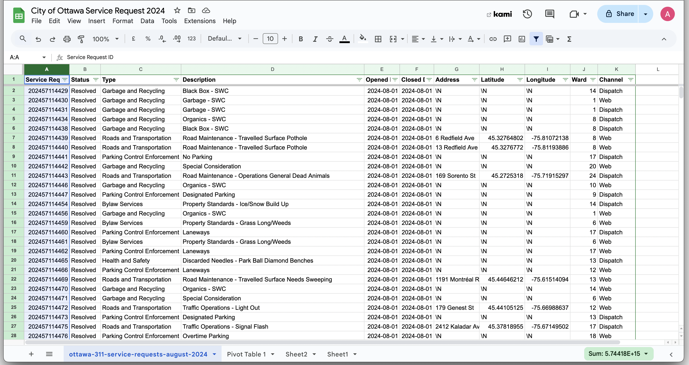

**October 30th, 2024**<br>
**MPAD2003 Intro to Data Storytelling**<br>
**Anand Ogungbemile**<br>
**Presented to Jean-Sébastien Marier**<br>

# Midterm Project: Exploratory Data Analysis (EDA)

Use one hashtag symbol (`#`) to create a level 1 heading like this one.
#Exploratory Data Analysis (EDA)

## Foreword

For this assignment, you must extract data from a dataset provided by the instructor. You must then clean and analyze the data, create exploratory charts/visualizations, and find a potential story idea. Your assignment must clearly detail your process. You are expected to write about 1500-2000 words, and to include several screen captures showing the different steps you went through. Your assignment must be written with the Markdown format and submitted on GitHub Classroom.

I have been assigning different versions of this project to my digital journalism and data storytelling students for a few years now. Its structure was inspired by the main sections/chapters of [*The Data Journalism Handbook*](https://datajournalism.com/read/handbook/one/). This version was further inspired by the [Key Capabilities in Data Science](https://extendedlearning.ubc.ca/programs/key-capabilities-data-science) program offered by the University of British Columbia (UBC).

**Here are some useful resources for this assignment:**

* [GitHub's *Basic writing and formatting syntax* page](https://docs.github.com/en/get-started/writing-on-github/getting-started-with-writing-and-formatting-on-github/basic-writing-and-formatting-syntax)
* [The template repository for this assignment in case you delete something by mistake](https://github.com/jsmarier/jou4100_jou4500_mpad2003_project2_template)

Did you notice how to create a hyperlink? In Markdown, we put the clickable text between square brackets and the actual URL between parentheses.

And to create an unordered list, we simply put a star (`*`) before each item.

## 1. Introduction

this Is a research report into City of Ottawa requests made in august 2020. The data comes from Open ottawa's website, but has been shrunk down from it's orignal size given to me with only the data pertaining to the select time frame. The data collected Is essentially A count of every time a service request was made, through the web page, phoneline, or in person at a government facility. In this report I will give a detailed breakdown of the steps I to recieve, and analyze this data. I will check its validity, and then use its variables to make calculations. Finally I will present my findings, through disscussion and visual representaion, before coming to a conclusion. 

## 2. Getting Data

The data was given to my by an industry Professor, which is often a good source for data. "Professors, public servants and industry folks often know where to look"(Data handbook 1). Becuase of the size of the data set, we are unable to use commands such as IMPORTDATA on Google Sheets, so instead we must download the raw data file, and import it into google sheets, Using the import option within the file tab. because the raw data file is a cvs, I choose the comma seperator option, and after a few second of waiting, all the data loads in perfectly. the data set contains 11 columns, and 28,539 rows(minus 1 becuase the top row  is for labels). Each row pertains to a specific service request made to the city of Ottawa. columns B shows the Ordinal data of whether the request is on going or resolved. Colunmns C and D give us more details about what the request was/is. E and F tell us the date a request was made and the date it was resolved, if it was (discrete data). G, H, I, and J are descripted of the location ( address, coordinates and ward) which are nominal. lastly, K gives us the way the request was made (walkin, web, email, dispatch, etc...) which also is nominal. On firstglance the is good quality. there are not any obvious major errors. the only real issue I can see with this set is the missing location data. many of the service requests have no address, or coordinates logged for them, which does  slightly hinder the credability of the data. Thankfully most of the requests have their Ward attatched, so we can get a general idea of where the requests with missing addresses and coordinates were made. Looking at this data, my main wonder is how long did certain requests take to be resolved in comparison to others and why? is the I correlation between the wait times, and what part of the city a request was made in? 

Use two hashtag symbols (`##`) to create a level 2 heading like this one.

To include a screen capture, use the sample code below. Your images should be saved in the same folder as your `.md` file.

<br>
*Figure 1: The "Import file" prompt on Google Sheets.*

**Here are examples of functions and lines of code put in grey boxes:**

1. If you name a function, put it between "angled" quotation marks like this: `IMPORTHTML`.
1. If you want to include the entire line of code, do the same thing, albeit with your entire code: `=IMPORTHTML("https://en.wikipedia.org/wiki/China"; "table", 5)`.
1. Alternatively, you can put your code in an independent box using the template below:

``` r
=IMPORTHTML("https://en.wikipedia.org/wiki/China"; "table", 5)
```
This also shows how to create an ordered list. Simply put `1.` before each item.

## 3. Understanding Data

### 3.1. VIMO Analysis
VIMO stands for Valid, invalid, missing and Outliers. It's and analysis method to determine the validity of a dataset. Its important to know about the validity of your data in order to add context to your findings and analysis. "Before we use data we should explore it to learn about the variables and concepts, and also to discover if there are errors, inconsistencies or gaps in the dataa" (Statscan) in this methodaa we take a look at the variables in the set, and ask is the data valid or invalid. for example, there are 24 wards in Ottawa, if one of our datapoints was given the value of ward 25, that is invalid. missing just means the value of the variable is unknown, or not logged. we see quite a bit of missing data within our data set,  particularly for the address variable, and also the coordinate variables. Outliers are variables which aren't invalid, but just doesn't match the general trend of the data. for example, if all the coordinates were relatively close, and one of the coordinates was far away from the rest, the would be an outlier. 

#### Location/Ward validity check
to check the validity of the ward data, I created a map in Google my maps and imported the the data from my spread sheet. Google my maps is "an engaging way to share data and important context with your audience"(Google News Initiative, 2024). I styled by ward, and import A kml file of Ottawa's ward borders. this was tricky because the amount of data points in the spreed sheet were more then the maximum number you can import with a layer at a time, so I had to eliminate the data points without ward information, or coordinate information, and then split the data into 2 layers. I'm still not sure if My Maps took all the data Imported, but it atleast took a large enought sample. looking at the map I dont see any data points with miss labeled Wards, so I will continue under the assumption that said data is accurate.

Use three hashtag symbols (`###`) to create a level 3 heading like this one. Please follow this template when it comes to level 1 and level 2 headings. However, you can use level 3 headings as you see fit.

<br>

#### Missing Data check
it doesn't take much analysis to see that there is a lot of missing data here. of the 28,538 requets, only 4390 give an exact location, and there are 1548 requests with no ward. 9 of the request with no ward have coordinate data and 1 has just its address, so those are repairable, but the remaining 1539 are valueless in terms of location. 

#### outliers
the most obvious Outlier visible to me was that the data of the final request was in september, where as the rest of the requests where from the month of august. seems like an accidental inclusion. if you want to use this data to come to a conclusion about service requests in the the month of august, you'd have to cut this one out. there are potentially other data point you could classify as outliers, but I am not able to find any other clear examples after combing through the data a few times

Support your claims by citing relevant sources. Please follow [APA guidelines for in-text citations](https://apastyle.apa.org/style-grammar-guidelines/citations).

**For example:**

As Cairo (2016) argues, a data visualization should be truthful...

### 3.2. Cleaning Data

My first step was to freeze the top row in place as a Label row, so that for one, I don't have to worry about it being misplaced to a different position while sorting and filtering, and so that the labels are always visible , so it is clear what each column represents so matter where you are looking on the spreadsheet. Then I implimented the filter feature of Google Sheets, so I could traverse the data set for specific variables far easier. I began stretching the columns to various proportions so that more of the data was visable and less space was wasted. while doing that, I ran into the issue of the discription column being far too wide, becuause of the inclusion of the french translations, so I used the `SPLIT` function to separate and delete the french.  

<br>
### 3.3. Exploratory Data Analysis (EDA)

I calculated the average amount of time each district takes to resolve or cancel a request in there district. How did I do this? Well I started by using the `DATEIF` function, which allows you to get the difference between to dates. I copied the function down the spread sheet. then I used the `AVERAGEIF` function to get the average of each date difference based on which ward the request was from. I also used pivot table to find the total amounts of requests in each Ward. the results were not all that interesting. ward 12 had the most request, and ward 4 had the longest wait times, but the margins are not large enough for me to make any confident claim. 


**This section should include a screen capture of your pivot table, like so:**

<br>
*Figure 2: This pivot table shows...*

**This section should also include a screen capture of your exploratory chart, like so:**

<br>
*Figure 3: This exploratory chart shows...*

## 4. Potential Story

why does Ward 4 have disportionately a higher average resolution time then other Ward? dispite its request totals being around the average, Its wait times are longer then any other ward. The only one close being ward 5. According to the city of Ottawa web page, the ward has a population of 45,640, which is also around average. If I was to write a story about this, I think I would do some research into the wards funding, and see if there is potentially any relationship between the amount of funding each ward has access to and the amount of time it takes to process and complete these service request. maybe there is a narritive there about pushing for more funding of that area. one of the easier bits of research I could do would be to bring in the request type variable, and factor that into my calculations on average wait times. 

## 5. Conclusion
overall, I dont think my research showed a great enough level difference to come to a confident conclusion on how each ward was preforming in regard to time. ward 4 had the longest wait times, but not my a huge margin. The hardest part of this assignment was dealing with such a large data set. because of its size, make basic calculations can feel tedious because of the amount of scrolling. the same goes for trying to catch, errors, outliers and such. When you have so many data points, the begin to blend together, and you don't have as much time to spend analyzing. 
## 6. References

A Five Minute Field Guide. (n.d.). DataJournalism.com. Retrieved November 2024, from https://datajournalism.com/read/handbook/one/getting-data/
a-five-minute-field-guideData 

Accuracy and Validation: Methods to ensure the quality of data. (2020, September 23). Www.statcan.gc.ca. https://www.statcan.gc.ca/en/wtc/data-literacy/catalogue/892000062020008

Google My Maps: Show where stories happen. - Google News Initiative. (2024). Google News Initiative. https://newsinitiative.withgoogle.com/resources/trainings/fundamentals/google-my-maps-show-where-stories-happen/
